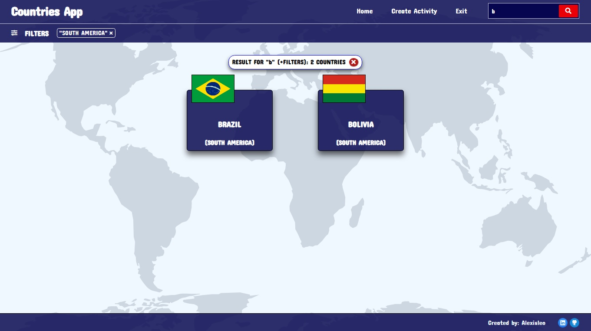

# Countries App

Esta es una aplicación web (SPA) centrada en información de países del mundo y sus actividades túristicas, aprovechando herramientas como React, Redux, Express, Sequelize y Postgres para brindar una experiencia fluida y amigable.

La idea general fue crear una aplicación en la cual se pueda ver información de  distintos paises utilizando la api externa [restcountries](https://restcountries.com/) y a partir de ella poder, entre otras cosas:

- Buscar paises
- Filtrarlos / Ordenarlos
- Crear actividades turísticas

## Frontend

En el desarrollo Frontend de la aplicación, se emplearon tecnologías como React y Redux.

## Capturas de Pantalla

A continuación, te presento algunas capturas de pantalla que te dan una idea visual de las características más destacadas de la aplicación:

**Landing Page:**


**Home:**


**Filtros:**


**Busqueda:**


**Detalles de cada país:**


**Crear una actividad turística:**


### Iniciar la Aplicación desde el lado del Frontend:

Si deseas ejecutar la aplicación en tu entorno local, sigue estos sencillos pasos:

1. Navega hasta la carpeta principal del cliente:
   ```bash
   cd client
   ```

2. Instala las dependencias de la aplicación utilizando npm:
   ```bash
   npm install
   ```

3. Inicia la aplicación en modo de desarrollo:
   ```bash
   npm start
   ```

4. Abre tu navegador web y visita http://localhost:3000 para explorar la aplicación.

## Backend

La sección de backend de la aplicación está basada en tecnologías como Node y Express, y se implementan las siguientes rutas esenciales:

- [ ] __GET /countries__:
  - Retorna todos los países.

- [ ] __GET /countries/{idPais}__:
  - Retorna el detalle de un país en particular incluyendo los datos de las actividades turísticas correspondientes.

- [ ] __GET /countries?name="..."__:
  - Retorna los países que coincidan con el nombre pasado como query parameter (No necesariamente tiene que ser una matcheo exacto).

- [ ] __POST /activities__:
  - Recibe los datos recolectados desde el formulario controlado de la ruta de creación de actividad turística por body
  - Crea una actividad turística en la base de datos, relacionada con los países correspondientes.

### Iniciar la Aplicación desde el lado del Backend:

Si tienes curiosidad y quieres probar la aplicación en tu propio entorno, sigue estos pasos:

1. Dirígete a la carpeta principal del servidor:
   ```bash
   cd api
   ```

2. Instala las dependencias de la aplicación utilizando npm:
   ```bash
   npm install
   ```

3. Renombra el archivo ``.env.template`` a ``.env`` y reemplaza los valores de las variables correspondientes. 

4. Inicia la aplicación en modo de desarrollo:
   ```bash
   npm start
   ```

4. Abre tu navegador web y visita http://localhost:PORT para explorar la aplicación.
